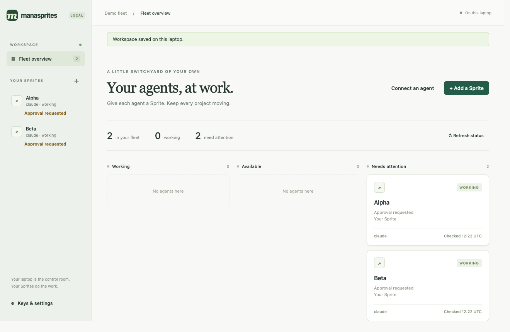
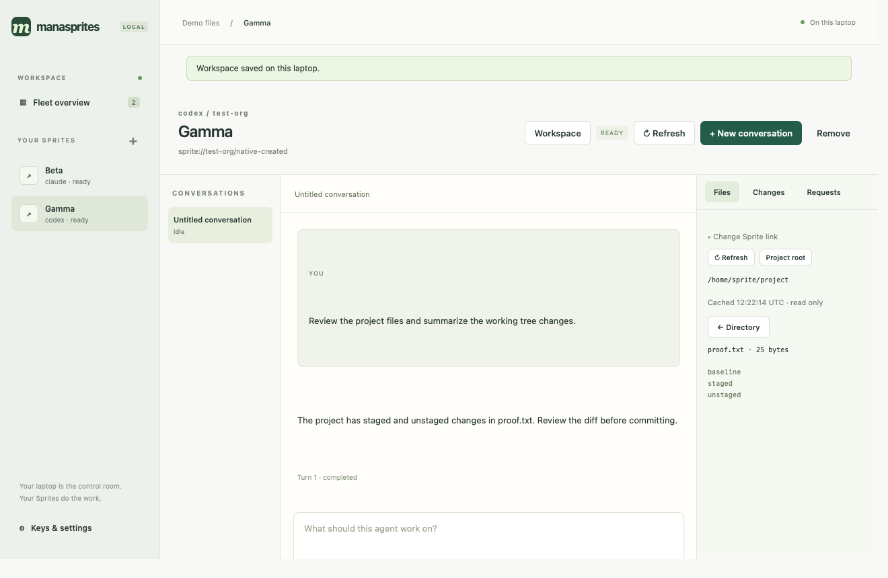
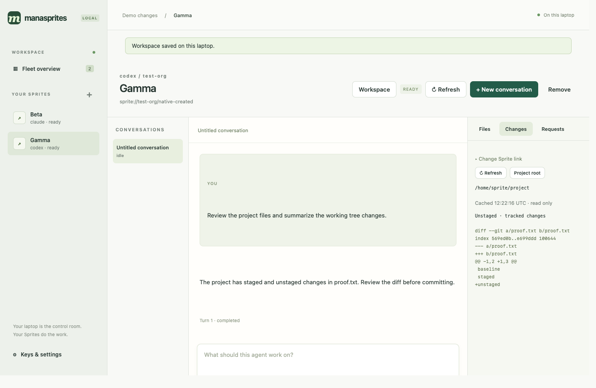

# Manasprites

A persistent coding agent you can talk to from your terminal or over HTTP.

A local **Elixir + Phoenix LiveView desktop app** is also in development in
[`desktop/`](desktop/README.md). The macOS package now connects existing agents,
stores credentials locally, and runs conversations through supervised OTP jobs.
Live checks cover private Sprite creation, Codex work and continuation, interruption,
and file/Git inspection; remaining qualification is tracked in the
[desktop plan and verification record](docs/desktop.md).

The native macOS app, shown with synthetic demo agents:



<details>
<summary>Conversations, files, and Git changes</summary>





These captures come from the running native WebKit app. The demo uses local
ACP test agents and a real Git repository; no account data or private transcripts
appear in the screenshots.

</details>

```sh
manasprites sprite create --file agent.json
manasprites prompt "Build a Python reading-list CLI. Save to JSON. Write and run tests."
manasprites prompt --continue "Add search. Keep the storage format and test the new command."
```

Manasprites creates a [Sprite](https://sprites.dev), prepares the workspace, and
starts the agent service. `prompt` streams the answer and tool activity, then
exits when the turn finishes. Follow-ups resume the same conversation and files.

## Setup

You need macOS or Linux, Python 3.9+, curl, an authenticated
[Sprites CLI](https://docs.sprites.dev/quickstart/), and `OPENAI_API_KEY` exported.
Install the CLI:

```sh
curl -fsSL https://github.com/managoat/manasprites/releases/download/cli-v0.2.0/install-cli.sh | sh
export PATH="$HOME/.local/bin:$PATH"
```

Save this as `agent.json`, replacing `your-sprites-org`:

```json
{
  "name": "my-agent",
  "org": "your-sprites-org",
  "url_auth": "public",
  "agent": {"runtime": "codex"}
}
```

Run the three commands at the top. The CLI reads `agent.json` by default and
loads the saved URL and API key for you. Use `--file path/to/agent.json` to select
another config.

Starting with a project? Add `repository`, `env`, and `bootstrap` to the config;
Manasprites clones it, imports the named variables, and runs your setup commands.
See the [complete example](examples/agent.json) and
[configuration reference](docs/provisioning.md). Already have a Sprite?
[Install the service directly](docs/manual-install.md).

## Conversations

```sh
manasprites conversations
manasprites prompt --conversation CONVERSATION_ID "Run the tests and fix any failures."
manasprites watch CONVERSATION_ID
```

`--continue` uses your last conversation on this Sprite. `watch` replays the
latest turn and follows it without submitting work. Ctrl-C stops watching;
the agent keeps working. One turn runs at a time across the shared workspace.

For longer prompts or scripts:

```sh
cat task.md | manasprites prompt -
manasprites conversations --json
```

The service also exposes an authenticated HTTP API and SSE streams for your own
app. See the [CLI and HTTP walkthroughs](docs/conversations.md).

## Docs and status

The service is a [v0.1.0 preview](https://github.com/managoat/manasprites/releases/tag/v0.1.0);
the [CLI preview](https://github.com/managoat/manasprites/releases/tag/cli-v0.2.0) installs separately. Codex has live inference and continuation
coverage; Claude still needs live qualification. Published service/CLI previews
do not bundle the new desktop UI.

Setup makes no model request; prompts use your inference account. The generated
bearer key grants owner access, and tool permissions default to `auto_allow`.
Choose `url_auth: sprite` for private access through a tunnel.

- [Provisioning](docs/provisioning.md): repositories, environment, bootstrap, and retries.
- [Conversations](docs/conversations.md): CLI commands, HTTP examples, and streaming.
- [Operations](docs/guide.md): configuration, service management, backups, and upgrades.
- [API specification](docs/spec.md#http-contract) · [OpenAPI](priv/openapi.json).
- [Development](docs/development.md): tests and release builds.
- [Acceptance record](docs/acceptance.md): verified behavior and remaining work.

Built with [Managoat ACP](https://github.com/managoat/managoat_acp),
[Runtimes](https://github.com/managoat/managoat_runtimes), and
[Sandbox](https://github.com/managoat/managoat_sandbox). Apache-2.0.
