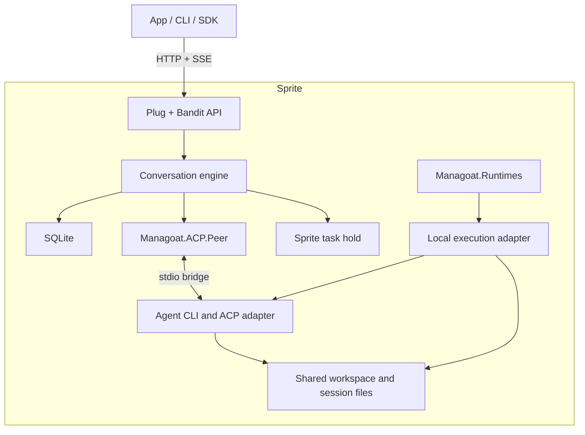

# Managoat Sprite: installable conversations API

Status: implementation target; see acceptance.md for current verification. Written 2026-09-07.

The laptop fleet application is specified separately in [desktop.md](desktop.md).
Its local Phoenix LiveView UI, OTP supervisors and Ecto/SQLite state extend the
host product; they do not change this document's single-Sprite service contract.
The web UI/fleet deferrals below apply to the service's original release scope.

## Product contract

Provision a Sprite, run one installation command inside it, and that computer now serves Managoat's conversations API. The installer supplies the application and its runtime dependencies, configures one agent, registers a persistent HTTP service, and verifies readiness. The operator supplies inference credentials and chooses the workspace. No Fountain account, external database, Elixir toolchain, or Managoat control plane is required.

The service installer adopts the computer it is installed on. An optional
host-side provisioning CLI can now create that Sprite first, clone a repository,
run explicit bootstrap commands, install a pinned service release, and verify
connection details. Its configuration and recovery contract are documented in
[provisioning.md](provisioning.md). These setup operations run outside the
conversation engine. The host CLI also provides `prompt`, `conversations`, and
`watch` commands over the service API; see [conversations.md](conversations.md).
Creating a conversation never provisions another machine. Ending or deleting a conversation never destroys the Sprite or removes the operator's workspace.

Host product and executable: `manasprites`. The Sprite service retains its
`managoat` operator command. Repository: `manasprites`. OTP application: `managoat_sprite`.
The source is published at https://github.com/managoat/manasprites. The
custom distribution URL below remains proposed. The v0.1.0 preview is distributed
through GitHub Releases; see [manual-install.md](manual-install.md) for the working installer command and
acceptance.md for qualification status.

## The installation experience

Inside a freshly provisioned Sprite, with `ANTHROPIC_API_KEY` already exported:

```sh
# Proposed distribution endpoint; not available yet.
curl -fsSL https://install.managoat.dev/sprite | sh -s -- \
  --runtime claude \
  --credential-env ANTHROPIC_API_KEY \
  --workspace /home/sprite/project
```

The command completes installation and starts the API. It must not stop at downloading an executable or leave a second manual `serve` step. The workspace is created if absent; existing files are adopted without resetting Git, deleting files, or running repository setup scripts. The agent can subsequently be prompted to inspect or prepare the project.

Proposed successful output:

```text
Managoat installed and ready
Service:    managoat
Agent:      default (claude)
Workspace:  /home/sprite/project
Local API:  http://127.0.0.1:8080/api
API key:    saved to /home/sprite/.local/share/managoat/config/client.key

Use `managoat status` to inspect service and agent readiness.
Use `managoat key show` to retrieve the API key.
```

If the caller exports `MANAGOAT_API_KEY`, install uses it instead of generating a key. This lets a provisioner know the credential before remote installation. Secret values never appear in command arguments or ordinary install output. `--json` returns version, service name, agent ID, local URL, key-file path, and readiness; it excludes secret values.

Installation imports only explicitly named inference credential variables, saves them in the application's private configuration directory, and loads them on each service boot. It does not depend on the original shell surviving. `--credential-file PATH` is the alternative for automation. API-key inference is the initial supported authentication path; automatic reuse of interactive CLI logins is deferred.

### Getting to the Sprite's URL

An installed API and a reachable public URL are separate states. Sprites defaults to platform authentication on its URL; our bearer key cannot substitute for a Sprites organization token. [Sprites HTTP access](https://docs.sprites.dev/working-with-sprites/).

Supported access modes:

| Mode | Setup | Application authentication |
|---|---|---|
| Private development | Keep the Sprite URL private; forward port 8080 with the Sprites CLI | Managoat bearer key through the tunnel |
| Direct application endpoint | Provisioner configures the Sprite URL with public platform access | Managoat bearer key on every application request |
| Existing gateway | Operator forwards traffic to the service through their gateway | Gateway configuration must preserve Managoat bearer authentication |

For the desired URL-plus-key experience, configure URL access while provisioning the Sprite. For an already selected Sprite, the documented external command is `sprite config update --url-auth public`. Then run the installer inside it. Public platform access does not make conversation endpoints anonymous. The install command does not need or retain an organization-wide `SPRITES_TOKEN`.

The installer must report local readiness separately from externally verified readiness. It must not construct a guessed Sprite URL. It prints an externally configured URL only when supplied by the provisioner or obtained from a verified platform interface. In the private mode, the documented external tunnel command is `sprite proxy 8080`.

### Installer requirements

1. Detect Linux architecture, libc compatibility, writable application paths, the Sprite management socket, workspace access, free disk, port availability, and existing HTTP services.
2. Resolve a release version once; download a matching archive and verify its published integrity metadata. Support `--version VERSION`. Versionless repeat installation retains the installed version; upgrades are explicit.
3. Install a self-contained OTP release with ERTS and compatible native dependencies. Build releases for each architecture advertised as supported; refuse unsupported systems before changing configuration. Do not compile Elixir on the Sprite.
4. Install the selected CLI and ACP adapter at tested versions. Reuse an existing compatible installation without silently replacing a mismatched operator-owned CLI; install an application-owned version when needed. The runtime lockfile records both CLI and adapter versions.
5. Create durable configuration, SQLite state, and a stable `default` agent ID. Import credentials, write instructions and skills, and perform runtime bootstrap through the Managoat libraries.
6. Register and start a Sprite Service named `managoat`, with its HTTP port set to 8080 by default. Its command is an absolute path to the stable release launcher. The launcher runs the application in the foreground and reads persisted configuration.
7. Verify authenticated HTTP access, schema readiness, executable availability, and ACP initialization. This check makes no model prompt and does not prove that a provider will accept inference credentials; report that distinction. `managoat doctor --inference` explicitly runs a small paid probe.
8. Return success only after service and agent initialization checks pass. On error, emit a named failed stage and a concrete next action; preserve diagnostics without printing credentials.

Sprites currently permits one service to own HTTP routing. If another service owns it, installation fails with `http_service_conflict` before changing the route. `--port` changes the listening port, not that ownership constraint. A deliberate `--no-http-route` mode installs behind an existing gateway and reports gateway configuration as pending. [Sprites Services](https://docs.sprites.dev/concepts/services/).

Repeated installation is idempotent: preserve keys, IDs, configuration, database, conversations, and workspace. A second installer is refused by an installation lock. Interrupted installation can be rerun. Stage downloads and release activation atomically; never rewrite a live database to complete installation.

## Initial scope

One installation has one configured agent, one shared workspace, one owner authority, and many conversations. Each conversation has an independent runtime session, but all conversations can see the same files. Only one turn may execute across the installation at a time. This avoids workspace mutation races and respects the current runtime libraries' shared configuration paths and concurrency limits.

The first end-to-end milestone supports Claude. The v0.1 release supports Claude and Codex after each passes the same installation, permission, continuation, and restart acceptance suite. Gemini and OpenCode are later enablements: their current library layouts use `/tmp`, and their configuration/session storage must first be made and tested durable for this deployment. Package support alone is insufficient to advertise a runtime here.

Included: text prompts, follow-up turns, streamed blocks, durable history, cancellation, termination, conversation deletion, tool permission answers, API keys, CORS configuration, service management, and restart recovery.

Deferred: multi-user accounts, OAuth login, billing, a web UI, fleet placement, remote runners, multiple agent configurations, concurrent turns, image/file uploads, conversation trees, channels, scheduled work, autonomous background cycles after a turn, and the OpenAI-compatible or AG-UI endpoints. Unrequested out-of-turn activity must not silently become unmanaged work; v0.1 closes the ACP process at the end of each turn and resumes its saved session on the next turn. Warm process reuse is a subsequent optimization.

## Architecture and library boundaries



One OTP application initially, with explicit internal boundaries:

| Component | Responsibility |
|---|---|
| `Managoat.Sprite.HTTP` | Authentication, validation, API serialization, SSE, readiness |
| `Managoat.Sprite.Conversations` | Admission, lifecycle transitions, cancellation, permission resolution |
| `Managoat.Sprite.ConversationServer` | One supervised owner process per active conversation; routes peer reports |
| `Managoat.Sprite.Store` | Ecto with SQLite, migrations, transactions, durable events and idempotency |
| `Managoat.Sprite.Execution` | Process ownership, stdin/stdout/stderr, exit status, deadlines and process-group cleanup |
| `Managoat.Sprite.Sandbox.Local` | App-owned adapter connecting runtime provisioning to local execution and file writes |
| `Managoat.Sprite.Lifecycle` | Sprite task acquisition, renewal, release, boot reconciliation |
| `Managoat.Sprite.Install` | Release/configuration/service installation and upgrade |

Use a local Registry and DynamicSupervisor, with a singleton admission coordinator and a process-level lock on the state directory. No cluster registry or external queue is required. SQLite remains authoritative after a process restart.

Reuse `managoat_acp` for protocol, policy, block normalization, model selection evidence, and usage. Reuse `managoat_runtimes` for provisioning and pinned ACP adapters. Call optional runtime callbacks through the library dispatchers, which handle unloaded modules correctly.

The local sandbox adapter supports the execution operations that provisioning uses: `write_file`, `exec`, `spawn`, stdin writes and close, and command shutdown. Handles identify this installation only. Machine creation, destruction, policy changes, suspension and remote attachment return explicit `:not_supported` errors; conversation code never calls them. It is a restricted app adapter, not an advertised general sandbox provider, and must not claim full lifecycle conformance. Test the supported execution contract, including total errors and exactly one terminal frame.

The stdio bridge must preserve arbitrary byte chunks, keep stderr separate from protocol stdout, report real exit codes, and close process groups when its owner dies. A plain shell command or unmonitored `Port` is not sufficient evidence of those properties. Select and test a process supervisor/bridge in the first implementation milestone, including BEAM `SIGKILL` and orphan cleanup. No detached attach/replay transport is required for v0.1.

The engine persists semantic events and publishes notifications after commit. It exposes functions and messages rather than depending on HTTP connection lifetimes. Keep it inside this application until a second consumer justifies extracting `managoat_conversations`.

## Configuration and disk layout

Configuration file: `/home/sprite/.local/share/managoat/config/config.json`.
The implementation keeps private configuration under the application root and
uses a flat schema:

```json
{
  "host": "0.0.0.0",
  "port": 8080,
  "name": "Workspace agent",
  "runtime": "claude",
  "model": null,
  "workspace": "/home/sprite/project",
  "permissions": {"default": "auto_allow"},
  "cors_origins": [],
  "permission_timeout_seconds": 300,
  "turn_timeout_seconds": 3600,
  "max_request_bytes": 1048576
}
```

The logical agent ID is always `default`. Custom system instructions live at
`config/instructions.md` beneath the application root. Immutable snapshots
record runtime, workspace and the instruction digest; each turn records its
requested model and effective permissions.

`model: null` delegates to the runtime default; explicit selections go through `Managoat.Runtimes.Model`. Configuration is validated strictly. `managoat configure --file PATH` validates and stages changes, applies them only while idle, and restarts the service. Runtime, workspace and system-instruction changes are refused while retained conversations depend on the previous configuration; v0.1 does not quietly resume old sessions under a new agent definition. Model selection and stricter permission policies may change between turns and are recorded on each turn.

The default permission policy enables unattended operation for a trusted operator's own Sprite. Operators may configure `ask` or `auto_deny`; request-specific policies can narrow but never widen the configured policy. This is tool protocol behavior, not a security boundary against code running on the same computer.

| Path beneath `/home/sprite` | Contents |
|---|---|
| `.local/share/managoat/releases/<version>/` | Immutable application releases |
| `.local/share/managoat/current` | Active release pointer |
| `.local/bin/managoat` | Stable management launcher |
| `.local/share/managoat/config/` | Config, instructions, selected credentials, optional client key |
| `.local/share/managoat/state/` | SQLite database, WAL, schema version, installation identity |
| `.local/share/managoat/runtime/` | Application-owned executables and installation manifest |
| `project/` or configured workspace | Operator files; never treated as disposable application state |

Use mode 0700 for private directories and 0600 for credentials/client-key files. Store API-key digests in the database. Raw generated keys remain in the explicitly designated local client-key file until removed or rotated; they are never returned through HTTP. Avoid process environments and diagnostics containing unrelated inherited credentials. Do not overwrite an operator's existing runtime instructions/config without an explicit configuration choice: installer detects conflicts and reports them. Application-owned runtime homes are preferred where the runtime library supports them; any required layout extension must preserve existing consumers' defaults.

## HTTP contract

This is a named **Fountain conversations subset**, identified as `fountain-conversations-v1`. Compatibility applies to the endpoints and fields below, not to the entire Fountain API. Ship `/api/capabilities` and an OpenAPI document declaring supported features and deliberate differences.

All `/api/*` endpoints require `Authorization: Bearer <key>`, including streams and capabilities. `/healthz` is unauthenticated and returns only liveness. `/readyz` requires authentication and checks schema, configuration, local execution and admission readiness; it never calls a model provider. HTTP readiness remains available when admission is blocked so diagnostics can explain why.

| Method and path | Contract |
|---|---|
| `GET /api/agents` | `200 {"data": [agent]}`; stable ID `default`, name, runtime, model, description |
| `GET /api/agents/default` | `200 {"data": agent}` |
| `GET /api/conversations` | `200 {"data": [...]}`; newest first; support `agent_id` and validated comma-separated `status` filters |
| `POST /api/conversations` | Accept `agent_id` (defaults to `default`), nonempty `prompt`, optional `title`, optional narrowing `permission_policy`; `201 {"data": conversation, "meta": {"resumed": false}}` |
| `GET /api/conversations/:id` | `200 {"data": conversation}` |
| `POST /api/conversations/:id/prompts` | Nonempty `prompt`; `200 {"status": "queued"}` after durable admission |
| `GET /api/conversations/:id/turns` | `200 {"data": [...]}` ordered by turn number |
| `GET /api/conversations/:id/events` | Ascending durable event pages; `after`, `limit`, `streams`, `blocks` |
| `GET /api/conversations/:id/stream` | SSE; replay after `Last-Event-ID`, then live; no header replays from beginning; `wait=false` closes after replay |
| `GET /api/events/stream` | Installation-wide SSE; explicit cursor replays all retained matching events; no cursor starts at the subscription baseline |
| `POST /api/conversations/:id/requests/:request_id` | `{"option_id": "<offered optionId>"}`; `200 {"ok": true}` |
| `POST /api/conversations/:id/interrupt` | `204` once cancellation has been requested; terminal outcome arrives in events |
| `POST /api/conversations/:id/terminate` | Stop owned work and permanently close the conversation; `204` after termination is recorded |
| `DELETE /api/conversations/:id` | Stop owned work, then delete its API records; `204`; preserve shared files and Sprite |

`queued` means durably accepted for dispatch. It does not imply a backlog of competing turns. One active or admitted turn reserves the entire installation slot. Reject a second prompt on that conversation with Fountain's `400 {"error":"conversation_busy"}`; reject work for another conversation with `409 {"error":"sandbox_at_capacity"}`. Admission and turn insertion are atomic, including initial conversation creation.

Unknown conversation/agent IDs return 404. Terminal conversations reject prompts with 410. Invalid bodies or unsupported requested features return 422; oversized bodies return 413. No running turn on interrupt returns 409 `no_turn_running`. Resolved or expired permissions return 409 `permission_request_resolved`; an unoffered option returns 422 `unknown_option`. Unavailable storage, runtime setup, or task holds return 503 with a stable machine-readable code. Errors use `{"error":"code","message":"human-readable explanation"}`; clients must not parse prose.

Reject supplied platform fields such as `vault_id`, `environment_id`, `channel_id`, `sandbox_id`, images, and parent-conversation headers with `unsupported_feature`, rather than appearing to honor them. Requests never change runtime, workspace or inference credentials. Do not expose machine-destruction routes.

Conversation fields guaranteed in v1: `id`, `title`, `first_prompt`, `agent_id`, `runtime`, `acp`, `status`, `turn_count`, `runtime_session_id`, `permission_policy`, `last_active_at`, `usage_total`, `inserted_at`, and `updated_at`. Platform-only fields are omitted and documented as unsupported, rather than fabricating Fountain records.

Turn fields: `id`, `turn_number`, `prompt`, `status`, `origin` (always `user` in v0.1), `exit_code`, `started_at`, `ended_at`, `inserted_at`, `image_count` (0), `model_selection`, and nullable `usage`. Usage is recorded once from the terminal protocol report; unknown usage stays null. Additive `failure_reason` distinguishes recovery interruption, timeout and runtime failure.

### Durable events and SSE

Event records use a globally increasing SQLite integer ID and Fountain's payload fields: `kind`, `stream`, `data`, `stage`, `state`, `duration_ms`, `turn_id`, and `ts`. Installation-wide SSE additionally includes `conversation_id`. `blocks=true` adds normalized blocks; stage events carry an empty block array. Supported stream filters include `acp`, `stdout`, `stderr`, and `stage`.

REST pages return `{"data":[...],"meta":{"limit":1000,"has_more":false,"next_cursor":42}}`. Default limit is 1000; maximum is 1000. Empty pages have a null cursor. `after` is exclusive. Filtering never renumbers event IDs. Reject malformed cursors; preserve gaps after deletion and never reuse IDs.

SSE records retain Fountain's `id: <integer>`, `event: <kind>` and JSON `data:` framing. Send `: connected` immediately and comment heartbeats every 15 seconds. Conversation stage transitions include `turn/started`, `turn/done`, `turn/failed`, and `turn/interrupted`. Installation streams also emit Fountain's non-durable `event: conversations` invalidation hint when the list changes; a client refreshes from REST.

Subscribe before capturing a high-water mark, read committed rows through that mark, then drain newer rows from the database in order. PubSub is a wake-up hint, not the only copy of an event. This closes the replay/live race and prevents a crash between commit and notification from losing an event to connected clients. Bound subscriber buffers; disconnect slow subscribers so they can resume from their last ID. Delivery is at least once across reconnects; clients deduplicate by ID.

Close streams after 60 seconds without a durable event, regardless of heartbeat activity. Existing clients that immediately reconnect remain compatible but may keep waking the Sprite. A sleep-aware client closes its stream after the final turn, fetches history and reconnects on the next user action. Receiving unsolicited remote activity while a client is entirely disconnected requires polling or an external push service; v0.1 promises neither. No background health polling is installed by Managoat itself.

### Request idempotency

Support `Idempotency-Key` on create and prompt. Persist a request fingerprint, operation, resulting IDs and response in the same admission transaction. Same key and same request return the original response; same key with a different request returns 409 `idempotency_conflict`. Scope keys to the installation owner and operation, not a rotating API-key string. Keep records while their conversations exist; retain deletion tombstones for at least seven days and return 410 rather than recreating deleted work. Document the retention horizon.

Idempotency prevents repeated HTTP submissions. It cannot make arbitrary agent tool effects exactly once.

## Persistence and turn execution

SQLite uses WAL, foreign keys, a busy timeout, transactional migrations, and `synchronous=FULL`. Own the database through one application instance. The database and runtime session files must live on persistent storage; `/tmp` is not an accepted location for authoritative application state.

Minimum tables:

| Table | Durable facts |
|---|---|
| `installation` | Identity, schema/config versions, admission and recovery metadata |
| `agents` | Stable ID and immutable launch-configuration snapshot |
| `conversations` | IDs, runtime session, lifecycle, timestamps, configuration reference |
| `turns` | Prompt, sequence, dispatch phase, ACP request ID, status, usage, failure reason |
| `events` | Global ID, conversation/turn IDs, raw protocol or stage data, timestamp |
| `permission_requests` | Request ID, turn, tool/options, absolute deadline, resolution state |
| `api_keys` | Key digest, label, created/revoked timestamps |
| `idempotency_requests` | Owner/operation/key, request fingerprint, response or tombstone |

Enforce unique `(conversation_id, turn_number)` and at most one nonterminal admitted turn across the installation. Conversation statuses are `pending`, `running`, `idle`, `failed`, `terminated`; turn statuses are `pending`, `running`, `completed`, `failed`, `interrupted`. Permission waiting and dispatch uncertainty are internal substates, not new public status vocabulary.

Execution sequence:

1. Validate and atomically persist admission, prompt, idempotency result, and reserved capacity. Return the HTTP acknowledgement independently of execution.
2. Acquire a Sprite task hold. Start the local ACP process, resume the stored runtime session or create one, and persist the session ID. A resume failure never silently substitutes a new empty session.
3. Before permitting any `session/prompt` write, commit `dispatching` intent. Wrap the peer's writer so this barrier precedes the first prompt byte; `Peer`'s later `prompt_sent` report alone is not a sufficient crash barrier. Persist its request ID as soon as known.
4. Persist peer output and permission asks before notifying subscribers. Bound event ingestion; on storage failure stop execution and block new admission. Never continue an unaudited run indefinitely because logging failed.
5. On the terminal prompt response, persist terminal status, usage, final stage and conversation state together. Close the ACP process and owned process group, verify exit, then release capacity and the task hold. Do not start another turn while cleanup remains uncertain.

Persist permissions with wall-clock deadlines. Allow only the offered option IDs and resolve races with a transactional compare-and-set. The peer's answer writer follows the same record-before-send discipline. If a crash leaves a recorded decision with uncertain delivery, recovery interrupts the turn; it does not resend a tool authorization automatically. On timeout, deny through the peer and record resolution. Permission asks occupy the active slot and task hold until answered or timed out.

Interrupt sends ACP cancellation, waits up to a configurable 10 seconds for a terminal response, then terminates the owned process group if needed. Distinguish cooperative cancellation from forced termination in failure metadata. A stop can leave files partially edited or remote actions already performed. Termination and deletion wait for cleanup before finalizing; cleanup failure returns an error and blocks admission rather than orphaning work.

## Sleep, restarts and honest recovery

Registering a Sprite Service restores the API process on cold boot; it does not preserve a local ACP process across every restart. Warm wake can preserve memory, while network connections can still fail. Durable history and saved runtime sessions are the recovery foundation. [Services](https://docs.sprites.dev/concepts/services/), [task/lifecycle behavior](https://docs.sprites.dev/keeping-sprites-running/).

Each admitted executing turn holds a task named `managoat-<installation-id>-<turn-id>`. Use the local management socket `/.sprite/api.sock`, virtual host `sprite`: `PUT /v1/tasks/:name` with `{"expire":"5m"}`, renew every 60 seconds, and `DELETE` after cleanup. Also hold a task during installation/upgrade work that needs to finish unattended. A task expires if its owner stops renewing. [Tasks API](https://docs.sprites.dev/keeping-sprites-running/).

A failed initial hold prevents dispatch. Retry renewal with bounded backoff while the previously confirmed hold remains valid; if it cannot be restored before a safety margin to expiry, cancel the turn and record `sprite_hold_lost`. Boot removes only stale task names belonging to this installation, after reconciling owned processes. Permission deadlines and turn timeouts are re-evaluated after a wake.

| Failure boundary | v0.1 behavior |
|---|---|
| HTTP client or SSE disconnects | Turn continues under its owner and task hold; events remain replayable |
| Idle application restarts or Sprite cold-boots | Reopen SQLite; resume saved runtime session when the next prompt arrives |
| Accepted turn remains `pending`, with no dispatch intent | Recover admission and dispatch it; it has not reached the runtime |
| Process dies after `dispatching`, including the send/ack gap | Kill/reconcile owned execution; record `interrupted` with `execution_outcome_unknown`; never automatically resend the prompt |
| Runtime dies during a turn | Record failure, clean up, and preserve history and session pointer for an explicit follow-up |
| Runtime session cannot be resumed | Report `session_unavailable`; preserve transcript; user can explicitly start a new conversation |
| Database cannot be read or written | Refuse new work and expose degraded readiness; never create an empty replacement database |
| Sprite itself is deleted | Data is lost unless independently backed up; this service cannot recover the destroyed computer |

On restart, reconcile outstanding turns and process ownership before becoming ready for new work. Never signal an arbitrary saved PID: use process start identity and ownership evidence, or the bridge's equivalent. If orphan cleanup cannot be proved, remain unavailable for writes. An interrupted conversation may accept an explicit follow-up when its saved session can resume; the API retains the interrupted turn and its reason.

Seamless mid-turn reattachment after an application crash is deferred. It would require an independently supervised execution daemon with durable byte journals and input acknowledgements, not simply extra fields in SQLite. v0.1 promises retained history, safe interruption reporting, and follow-up continuation.

## Operations and authority

Proposed commands: `managoat status`, `doctor [--inference]`, `logs`, `restart`, `stop`, `start`, `configure --file`, `key show`, `key rotate`, `upgrade --version`, `backup --output`, and `uninstall`.

`status` distinguishes installed, process running, API ready, agent initialized, and external access unverified/verified. `logs` shows operational logs, not a duplicate of raw conversation prompts. Never include credentials or full provider responses in ordinary service logs. Configure a bounded log size, disk reserve, and maximum stored output per turn; initial defaults are 50 MiB rotated operational logs, 256 MiB disk reserve, and 100 MiB output per turn. Cancel with a recorded error when an output budget is reached; reject new admission when reserve is exhausted. Do not silently prune transcript events in v0.1.

Upgrade downloads and checks the candidate before changing the active release. Refuse while a turn is active, quiesce admissions, back up SQLite consistently, run compatible migrations, switch the launcher and health-check. Define supported rollback schema ranges in the release manifest. Never claim rollback safety for an incompatible migration or restore the entire workspace as a side effect. Retain the previous release. Uninstall unregisters the service and removes application executables; it preserves state, credentials and workspace unless the operator separately requests their removal.

`backup` requires an idle installation and temporarily blocks admission. Use SQLite's backup API and capture configuration and supported runtime session files in a consistent archive; exclude API keys and inference credentials by default, listing omitted files in the manifest. Include workspace only with an explicit option. The archive is sensitive because conversations and runtime files can contain private content. Restore is an offline operation to an empty state directory, with schema validation and new API keys.

Every bearer key grants owner access to this installation. CORS defaults to no cross-origin browser access; explicit origin entries enable the templates and allow Authorization, Content-Type, Last-Event-ID, and Idempotency-Key. Handle preflight without requiring a bearer token and do not reflect arbitrary origins. API limits apply before parsing large bodies. The service is an authenticated remote-code-execution authority by design, through the configured agent.

The service and agent share a trust domain. Local credentials, transcripts and approval controls are not protected from an agent with equivalent OS privileges. `ask` is an interaction policy, not a hardened independent authorization system. If protected credential injection is needed, run `managoat_broker` beyond that boundary and configure egress separately. The initial product does not install the broker or promise multitenant isolation.

## Acceptance and delivery

The release is accepted when a provisioner can create a clean Sprite, inject inference credentials, run the proposed single command, and exercise the entire contract without SSHing back in to repair setup.

Required end-to-end scenarios:

1. Fresh install reaches an authenticated API; missing/invalid keys fail; shell exit does not stop the service. Direct URL mode and private tunnel mode both work, including CORS preflight and real streamed first bytes through the Sprite proxy.
2. Existing workspace survives install, conversation creation, interruption, termination, deletion, upgrade and uninstall. Conflicting HTTP services and runtime config cause explicit failures without takeover.
3. Create a conversation, observe text and tool blocks, finish, and send a follow-up that demonstrates runtime context retention. Run for each advertised runtime, recording CLI and adapter versions.
4. Connect the existing `fountain-template-chat` client in API-key mode with only base URL, API key and CORS configuration changes. Validate REST envelopes, event pagination, global SSE, interruption, and reconnection. OAuth UI is outside compatibility scope.
5. Two simultaneous admissions produce one accepted turn. Repeated idempotency keys never duplicate dispatch. Delete then retry produces a tombstone response within the retention period.
6. Disconnect the browser during a long silent tool call; the task hold keeps execution alive and reconnect replays ordered events. A slow subscriber cannot exhaust server memory.
7. Exercise an event committed during replay, a crash after commit before notification, and legitimate repeated identical output. Verify ID-based replay without missing or content-deduplicating real output.
8. Kill the BEAM at pending, dispatch-intent, prompt-write, permission-answer, and completion boundaries. Check documented recovery, no automatic ambiguous replay, cleanup of owned processes, and no second execution while cleanup is uncertain.
9. Cold-wake after an idle period; retrieve history and continue the runtime session. Test missing/corrupt runtime session and database failures without fabricating continuity.
10. Ask/allow/deny/timeout permission flows, invalid option IDs, concurrent answers, narrowing policies, and requests made after cancellation all behave deterministically.
11. Repeated install and idle upgrade preserve identity and state. Simulate failed download, failed migration and health-check failure; verify the operator has a usable previous release or an explicit offline recovery path.
12. Verify hold acquisition/renewal failure, timeout, output budget and disk-full behavior; no abandoned heartbeat loop remains. Observe that an idle installation with no clients/tasks sleeps, while a continuously reconnecting client is not claimed to do so.

Use `Managoat.ACP.Testing.ScriptedAgent` for deterministic protocol/engine tests and local process fixtures for execution semantics. Add a shared API contract fixture derived from the existing Fountain client and serializers. Live Sprite checks are necessary for services, task holds, URL auth, process cleanup and cold wake; a mocked HTTP test cannot establish those claims.

Implementation order:

| Milestone | Reviewable result |
|---|---|
| 1. Install-to-first-conversation | Release packaging, local execution bridge, one-command install, Claude setup, API key, task hold, create/events/follow-up; validate runtime cwd/config isolation and proxy streaming |
| 2. Durable API | SQLite admission, idempotency, full scoped REST/SSE contract, permissions and cancellation; existing chat client passes |
| 3. Recovery and lifecycle | Crash barriers, orphan cleanup, task failure handling, cold wake, disk/output limits, upgrade and backup |
| 4. v0.1 distribution | Codex parity, pinned release artifacts and hosted installer, OpenAPI/capabilities, complete acceptance suite on fresh Sprites |

Resolve these integration facts in milestone 1 before locking implementation details: supported Sprite architectures/libc; precise service launcher/update behavior; local process bridge death guarantees; runtime library changes needed for an application-owned config home and chosen cwd; and public/private ingress behavior with bearer headers and SSE. These are technical probes, not reasons to defer the product/API decisions above.

## Implementation references

Local code inspected for this proposal:

- [Managoat.Runtimes](https://github.com/managoat/managoat_runtimes/blob/main/README.md): provisioning responsibilities, callback dispatch, shared layouts and concurrency.
- [Managoat.ACP](https://github.com/managoat/managoat_acp/blob/main/README.md): transport seam, owner reports, session continuation, permissions and persistence responsibilities.
- [Managoat.Sandbox](https://github.com/managoat/managoat_sandbox/blob/main/lib/managoat/sandbox.ex): execution messages and adapter contract.
- [Goatherd driver](https://github.com/managoat/goatherd/blob/main/lib/goatherd/driver.ex): existing CLI composition; its remote detachable execution is not the proposed v0.1 local recovery model.
- [Existing chat API client](../../fountain-template-chat/src/api/client.ts), [types](../../fountain-template-chat/src/api/types.ts), and [SSE parser](../../fountain-template-chat/src/lib/sse.ts): initial compatibility consumer.
- [Fountain router](https://github.com/BinaryBourbon/fountain/blob/main/apps/fountain/lib/fountain_web/router.ex), [conversation controller](https://github.com/BinaryBourbon/fountain/blob/main/apps/fountain/lib/fountain_web/controllers/conversation_controller.ex), [serializer](https://github.com/BinaryBourbon/fountain/blob/main/apps/fountain/lib/fountain_web/controllers/conversation_json.ex), and [global events controller](https://github.com/BinaryBourbon/fountain/blob/main/apps/fountain/lib/fountain_web/controllers/events_controller.ex): current API shapes and error semantics. These are local inspection links; the implementation should pin a source revision in its compatibility fixtures.

This specification makes no claim that the proposed installer, server, local adapter, or recovery behavior already exists. Existing library and platform behavior is cited separately from the proposed host application.
